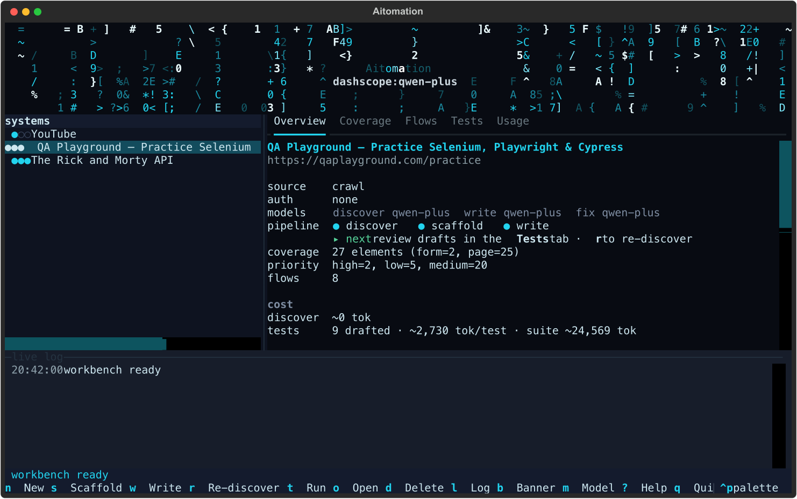
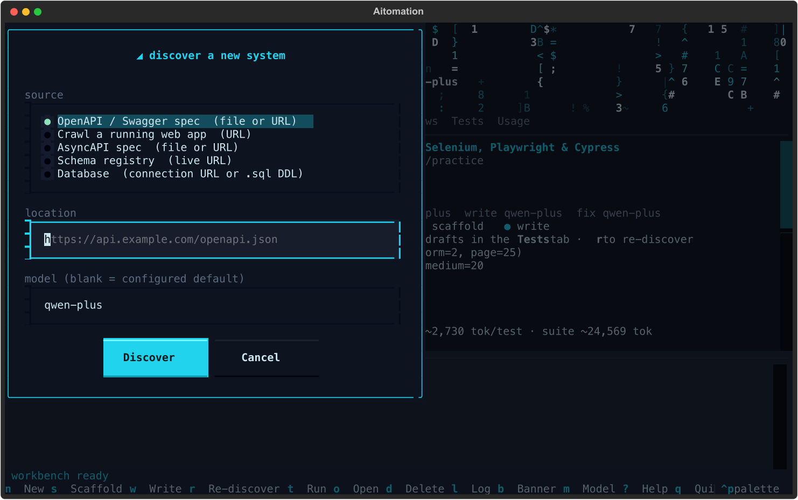
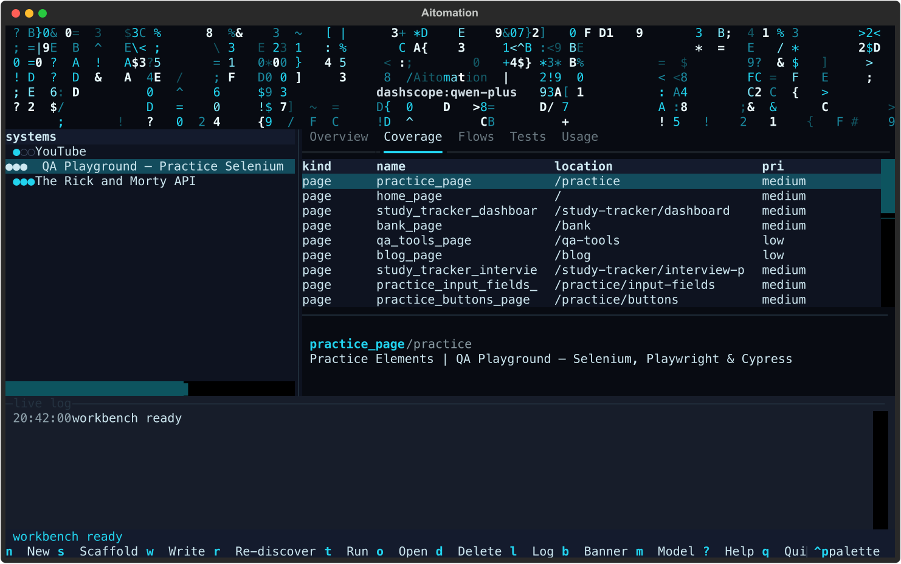
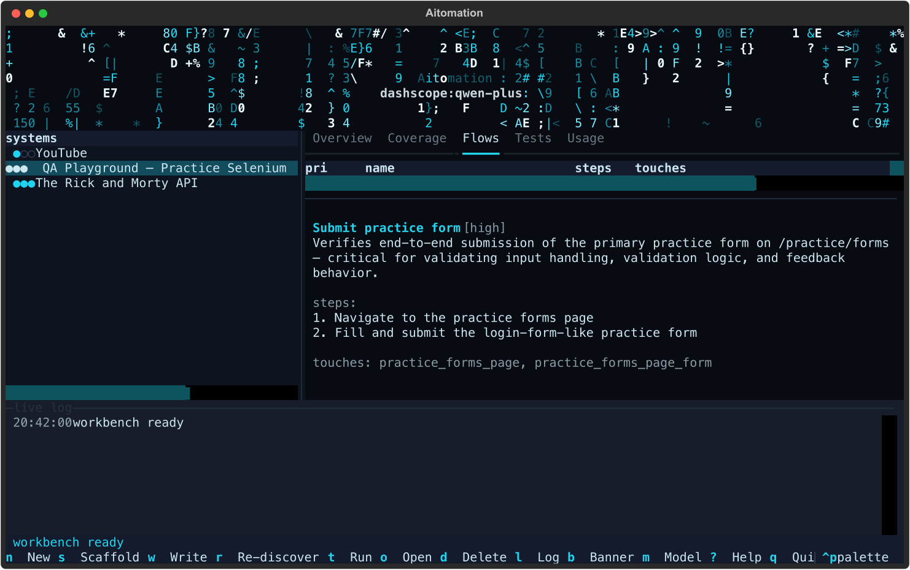
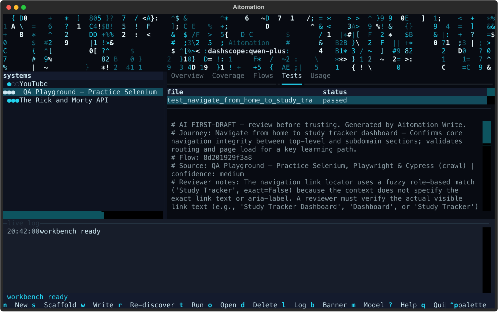
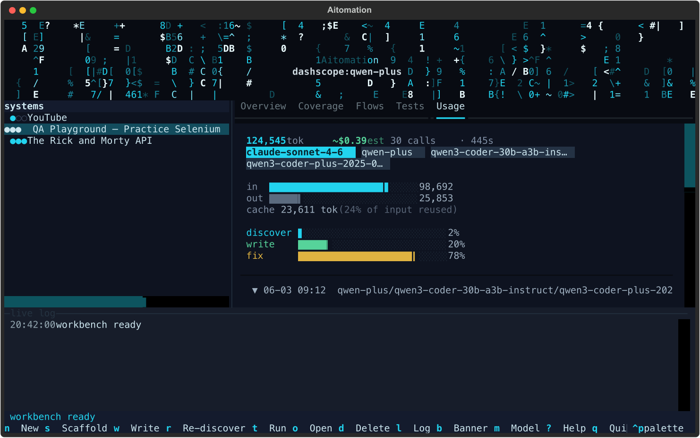
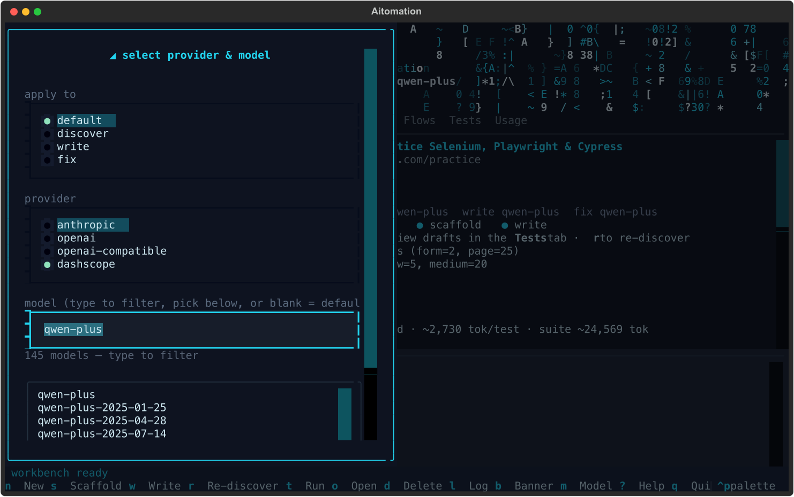
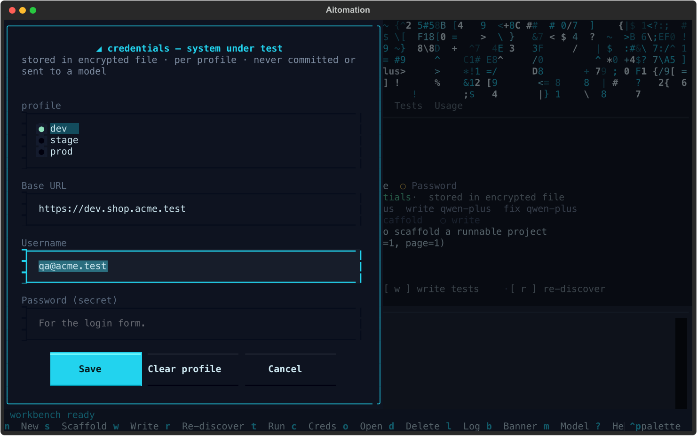

# Aitomation — Discovery Toolkit

Point it at a system → get a structured **coverage inventory**, a runnable Playwright +
pytest scaffold, and **first-draft tests per journey**. Model-agnostic, BYO-key, self-hostable.

The wedge is **Discover**: understand the system *first*. Most AI test writers hallucinate
because they have no system model. The `CoverageInventory` is that model — and everything
downstream (scaffold, drafts) is built from it.

<p align="center">
  
</p>

> **Determinism boundary.** This tool **discovers, scaffolds, and drafts**. It never decides
> pass/fail. AI is the analyst and author, never the judge. Scaffolding is pure templating
> (no LLM); committed tests use deterministic Playwright assertions; **pytest** decides
> pass/fail, even inside the TUI.

## What it does

| Stage | What | State |
|-------|------|-------|
| **Discover** | OpenAPI / Swagger spec → validated `CoverageInventory` | ✅ |
| **Discover** | AsyncAPI spec (channels → topics, messages → schemas) | ✅ |
| **Discover** | Schema registry (Confluent-compatible REST) | ✅ |
| **Discover** | Database — live reflection or a `.sql` DDL file | ✅ |
| **Discover** | Live crawl of a running web app (a11y tree, not pixels) | ✅ |
| **Scaffold** | Copier → runnable pytest + pytest-playwright project (**no LLM**) | ✅ |
| **Write** | First-draft test per journey, into the scaffold (review-only) | ✅ |
| **Fix** | Self-heal failing drafts — one corrective retry each | ✅ |

> The crawler uses Playwright (Python) directly for a bounded, deterministic same-origin BFS —
> not an agent driving a browser — so artifacts are reproducible and testable.

## Setup

```bash
uv sync
uv run aitomation tui          # first crawl also needs: uv run playwright install chromium
```

`uv` for everything — project, deps, Python version, venv. Set a provider key (below) and
discover/write light up; without one you can still browse, scaffold, and run.

---

## The Workbench

A master-detail terminal app (Textual): a browsable **Systems** library on the left, a tabbed
**System view** on the right, a **live log**, an onboarding **wizard**, a provider/model
picker, and a command palette. Restrained cyberpunk styling — a single cyan accent on
near-black, with an animated matrix-rain header banner (fold it with `b`).

It drives the *same* pipeline as the CLI and writes to the *same* artifacts, so you can move
between the two freely.

### Discover a new system

Press `n` for a guided wizard — no commands to memorise. Pick a source (the five discovery
backends), paste a URL / file path / connection string, optionally name a model, and go.

<p align="center">
  
</p>

Every discovered system is persisted to the library with **pipeline progress dots**
(`discover · scaffold · write`) and is re-openable across sessions. Press `r` to re-discover
— it reports what changed since last time.

### Read the system: Coverage and Flows

**Coverage** is every testable element with its inputs and auth preconditions — for OpenAPI,
*every endpoint* becomes an element deterministically, so the model can't invent or drop one.
Select a row for its details.

<p align="center">
  
</p>

**Flows** are the suggested end-to-end journeys the model proposed over that fixed surface —
select one for its steps and the elements it touches.

<p align="center">
  
</p>

### Scaffold, Write, Run, Fix — without leaving the TUI

- `s` **scaffold** a runnable pytest + Playwright project (deterministic, no LLM).
- `w` **write** first-draft tests, one per flow, into that scaffold (keeps existing drafts).
- `t` **run** the tests here — streams pytest to the live log; **pytest** decides pass/fail.
- `f` **fix** — self-heal the tests that just failed (one corrective retry each).
- `e` **enable** a skipped destructive draft after you've reviewed it (see below).
- `o` **open** the run folder in VS Code / PyCharm / Cursor / Antigravity.

The **Tests** tab lists every draft with a status that reflects the *last run*
(passed / failed / skipped / needs review), and previews the source — including its provenance
header, confidence, and reviewer notes.

<p align="center">
  
</p>

### Cost is first-class: the Usage tab

Every model call is instrumented (prompt, model, tokens in/out, cache, latency). The Usage tab
shows this system's spend: token total, a `~$` estimate, the exact model(s) used, in/out and
**per-stage** meters (`discover · write · fix`), cache reuse, and a per-run trend — so you can
compare models and providers on real cost. This is the model-agnostic thesis made measurable.

<p align="center">
  
</p>

### Switch models per stage (BYO-key)

Press `m` (or click the header) to change provider/model. Switching is **BYO-key**: a backend
with no key is rejected up front, not silently later. The provider's available models are
pulled **live** from its `/models` endpoint into a type-to-filter list (handy for Qwen's 100+
models), and the field still accepts a free-typed name so it works offline too.

The **apply to** selector targets the default *or a single pipeline stage* — so you can draft
on a cheap model and self-heal on a stronger one, and the Usage tab attributes each stage's
cost to the model that actually did the work.

<p align="center">
  
</p>

### Credentials for the system under test (`c`)

Discovery already detects whether a system sits behind auth (a bearer token, an API key, HTTP
basic, a login form, or a database URL). When it does, the **Overview** flags it and offers
`c` to securely type the credentials in — masked, per **deployment profile** (dev / stage /
prod). Test runs inject them into pytest's environment for the **active profile**; a per-profile
`BASE_URL` retargets dev vs prod.

<p align="center">
  
</p>

Where secrets live (in order of preference): the **OS keychain** (macOS Keychain / Windows
Credential Manager / Linux Secret Service) when one is reachable, else an **encrypted local
file** for headless Linux/CI. Either way they resolve to the same env-var contract, so CI
(its own secrets → env) is interchangeable. Secrets are **never** written to the repo, the
inventory, the run dir, the logs, or an LLM prompt — only into the child pytest process.

For **session** auth, `w` (Write) also authors `login.py`'s `perform_login()` from the
discovered sign-in form, so the suite logs in once (Playwright's `storage_state`) and reuses it.

Headless? The same store is scriptable: `aitomation creds set <system> AUTH_TOKEN`,
`aitomation creds list`, `aitomation creds clear <system> --all` (all take `--profile`).

> **Re-discovery is guarded.** `r` re-runs the model and rewrites the inventory, so it asks for
> confirmation first (your scaffold and reviewed drafts are kept; the diff reports what changed).

### Keys

| | | | | | |
|---|---|---|---|---|---|
| `n` new | `s` scaffold | `w` write | `r` re-discover | `t` run | `f` fix |
| `e` enable | `c` credentials | `o` open | `m` model | `d` delete | `l` log |
| `b` banner | `?` help | `q` quit | `Ctrl+P` palette | `↑/↓` move | `tab` switch |

### Where artifacts land

Each generation writes a visible, timestamped run:

```
projects/<app-slug>/e2e/run-<YYYYMMDD-HHMMSS>/
```

Each run is a self-contained, independently runnable scaffold + drafts. The CLI and TUI share
this layout, so a system scaffolded by one is listed and runnable by the other.

---

## Configure a provider (BYO-key)

Model-agnostic. Pick a backend via env; nothing is hardcoded. Enterprise QA data is sensitive —
there's no mandatory managed inference, and any OpenAI-compatible local server works.

| Backend | Env | Notes |
|---------|-----|-------|
| `anthropic` | `ANTHROPIC_API_KEY` | Claude (default) |
| `openai` | `OPENAI_API_KEY` | OpenAI models |
| `dashscope` | `DASHSCOPE_API_KEY` | Alibaba Qwen (OpenAI-compatible); free tokens, good for prototyping |
| `openai-compatible` | `AITOMATION_API_KEY` + `AITOMATION_BASE_URL` | Any local/OpenAI-compatible server (Ollama, vLLM) |

```bash
export AITOMATION_PROVIDER=dashscope
export DASHSCOPE_API_KEY=sk-...
# optional overrides: AITOMATION_MODEL, AITOMATION_BASE_URL, AITOMATION_TEMPERATURE
```

Local model example (Ollama):

```bash
export AITOMATION_PROVIDER=openai-compatible
export AITOMATION_BASE_URL=http://localhost:11434/v1
export AITOMATION_MODEL=qwen2.5-coder:7b
```

A `.env` in the repo root is loaded automatically.

> Capability scales with the model — local 7B models discover worse than frontier models.

---

## CLI reference

Prefer the terminal? Every Workbench action is also a command. `-p/--provider` and `-m/--model`
override the configured provider per run on any discover/write command.

**Discover** — writes a validated `CoverageInventory` JSON for the downstream stages, and a
human-readable summary to stdout. Each source has its own subcommand:

```bash
uv run aitomation discover openapi   examples/rickandmorty.openapi.json -m qwen3-max
uv run aitomation discover openapi   https://example.com/openapi.json --out inventory.json
uv run aitomation discover asyncapi  examples/asyncapi.yaml
uv run aitomation discover registry  http://localhost:8081
uv run aitomation discover db        postgresql://user@host/db      # or  ./examples/schema.sql
uv run aitomation discover crawl     https://rickandmortyapi.com/ --max-pages 8   # bounds: --max-pages (25), --max-depth (3)
```

**Scaffold** — deterministic templating from an inventory (Copier, **no LLM**). Adapts to what
was discovered: page objects for web pages/forms, an API client for endpoints, and an auth
fixture matched to the discovered scheme (bearer, API key in its *actual* header, HTTP basic,
or a session/login flow using the `storage_state` pattern). Pro defaults: trace + screenshot
retained on failure, registered markers, `Dockerfile`, a GitHub Actions workflow.

```bash
uv run aitomation scaffold inventory.json                  # → projects/<system-name>/
cd projects/<system-name> && uv sync && uv run playwright install chromium && uv run pytest
```

**Write** — one runnable pytest + Playwright draft per journey, into a scaffold (review-only,
**never auto-merged**). Each draft is lint-enforced: web flows must drive a Page Object and use
web-first `expect()`; API flows must use the request fixture; hard sleeps are banned. A
non-conforming draft is regenerated once with the findings fed back, then **quarantined** to
`drafts_needs_review/` if it still won't conform. `--verify` runs the drafts once and self-heals
failures (the CLI equivalent of the TUI's `f`).

```bash
uv run aitomation scaffold inventory.json                  # 1. skeleton  → projects/<system-name>/
uv run aitomation write    inventory.json -m qwen3-max     # 2. draft journey tests (same dir)
cd projects/<system-name> && uv run pytest                 # 3. run them
```

`scaffold` and `write` default to the same `projects/<system-name>/` directory; pass `-o`/`-i`
to point elsewhere.

**Enable** — drafts for *mutating* journeys (create/update/delete, password forms) are emitted
with a `pytest.mark.skip` guard so a generated `DELETE` never runs by accident. After you've
reviewed one and added teardown, lift the guard (deterministic, no LLM):

```bash
uv run aitomation enable                          # list skipped drafts under projects/
uv run aitomation enable test_create_pet          # enable one (in its scaffold)
uv run aitomation enable --all -i projects/store   # enable all in a given scaffold
```

`enable` only removes the guard *this tool* injected; a skip you added by hand is left alone.

**Creds** — store the system-under-test credentials a run injects, per profile (the headless
twin of the TUI's `c`). Values are kept in the OS keychain or an encrypted file, never the repo:

```bash
uv run aitomation creds list                              # what's stored, per system/profile
uv run aitomation creds set my-system AUTH_TOKEN          # prompted (hidden); or --value / --profile
uv run aitomation creds clear my-system --all             # wipe a profile
```

**Usage** — recorded LLM cost, grouped however you like:

```bash
uv run aitomation usage --by app,model     # cost per system, per model
uv run aitomation usage --by label         # per prompt / per test (e.g. write:test_pet_lifecycle)
uv run aitomation usage --by stage         # discover vs write vs fix
```

---

## How discovery works

1. **Deterministic extraction** — the spec is parsed (or the site crawled) into a factual
   surface. For OpenAPI, **every endpoint becomes a `TestableElement`** with its inputs and auth
   preconditions enumerated deterministically — the model cannot invent or drop endpoints, so
   coverage is complete and stable run-to-run.
2. **LLM judgement only** — the model ranks priorities, infers `auth_strategy`, and proposes
   end-to-end journeys over the *fixed* element list → a validated `CoverageInventory`. It
   decides what matters, never what exists.
3. **Backfill** — ground-truth fields (base URL, system name, source) are set deterministically,
   never trusted to the model.

## Develop

```bash
uv run pytest        # no API key needed: the LLM seam is stubbed; browser tests skip if no Chromium
```

Layout: `src/aitomation/{models,config,providers}.py`, `src/aitomation/discover/{openapi,asyncapi,registry,database,crawl}.py`,
`src/aitomation/scaffold/` (generator + Copier template), `src/aitomation/write/` (journey
drafting + self-heal), `src/aitomation/tui/` (the Workbench), CLI in `src/aitomation/cli.py`.

Regenerate the screenshots in this README with `uv run python scripts/screenshots.py`
(needs `rsvg-convert` — `brew install librsvg`).
